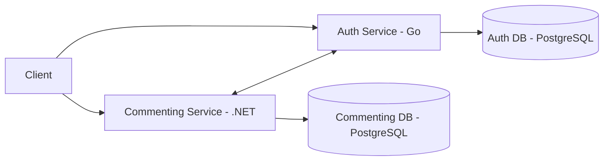
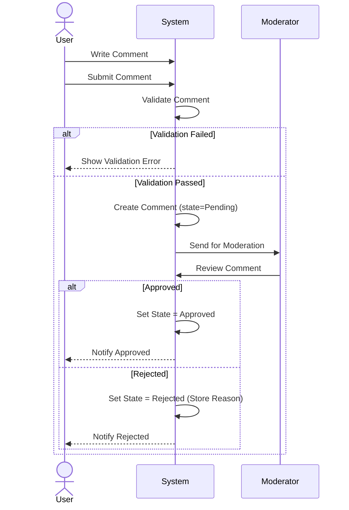
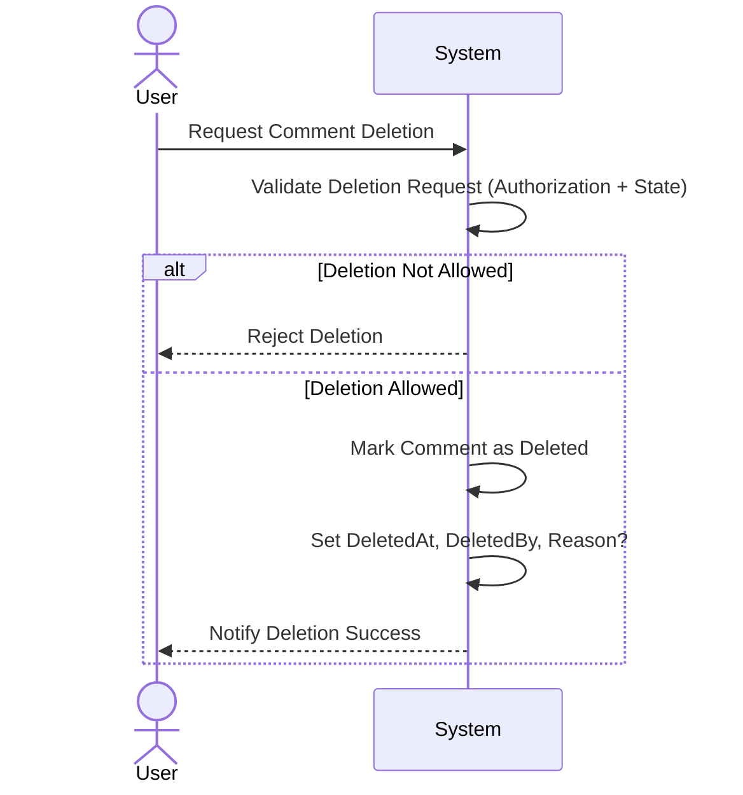
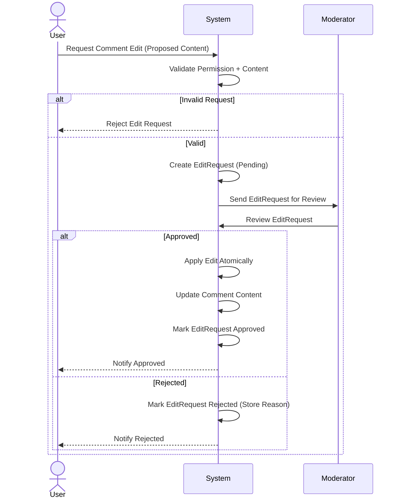
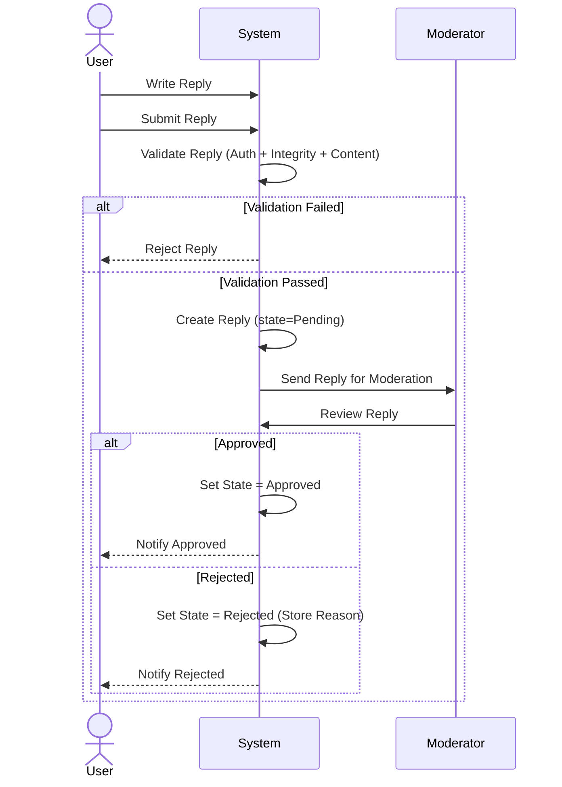

# System Diagrams

This document contains the main architecture and flow diagrams for the Commenting System.

---

## 1. High Level Architecture (Microservices)



---

## 2. Create Comment  (Comment Service)


---

## 3. Delete  Comment Flow



---

## 4. Edit Comment Flow 



---

## 5. Replay flow



## 6. Upvote Flow (Toggle Behavior)

```mermaid
sequenceDiagram
    actor User
    participant System

    User->>System: Commit Upvote

    System->>System: Validate Auth + Comment Visibility

    System->>System: Check if Vote Exists

    alt Vote Exists
        System->>System: Remove Vote
        System->>System: Decrement UpvoteCount
        System-->>User: State = Not Voted
    else Vote Not Exists
        System->>System: Create Vote
        System->>System: Increment UpvoteCount
        System-->>User: State = Voted
    end
    
 ```  


## 7. Soft Delete  (Toggle Behavior)

```mermaid
  sequenceDiagram
    actor Admin
    participant System

    Admin->>System: Request Soft Delete (CommentId)

    System->>System: Check Authorization (Admin)

    alt Not Authorized
        System-->>Admin: Reject (Forbidden)
    else Authorized
        System->>System: Load Comment(CommentId)

        alt Comment Not Found
            System-->>Admin: Reject (Not Found)
        else Comment Found
            System->>System: Set Comment.State = Deleted
            System->>System: Set DeletedAt, DeletedBy=Admin, DeletionReason?
            System-->>Admin: Confirm Soft Deletion
        end
    end
```


## Ban User by Admin (with period + reason)

```mermaid
 sequenceDiagram
    actor Admin
    participant System

    Admin->>System: Ban User (UserId, Duration, Reason)

    System->>System: Check Authorization (Admin)

    alt Not Authorized
        System-->>Admin: Reject (Forbidden)
    else Authorized
        System->>System: Validate Inputs (Duration, Reason required)

        alt Invalid Input
            System-->>Admin: Reject (Validation Error)
        else Valid
            System->>System: Load User(UserId)

            alt User Not Found
                System-->>Admin: Reject (Not Found)
            else User Found
                System->>System: Set User.Status = Banned
                System->>System: Set BannedUntil = Now + Duration
                System->>System: Store BanReason = Reason
                System-->>Admin: Confirm Ban Applied
            end
        end
    end
    ``` 
