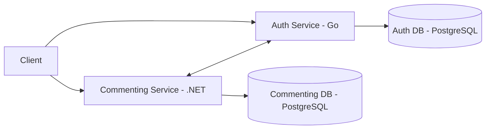
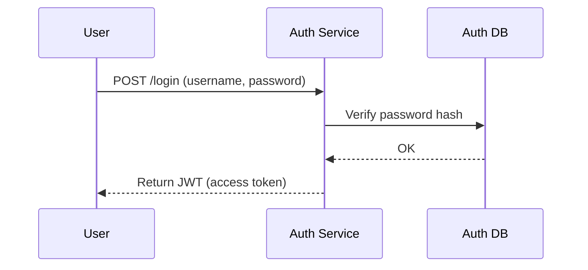
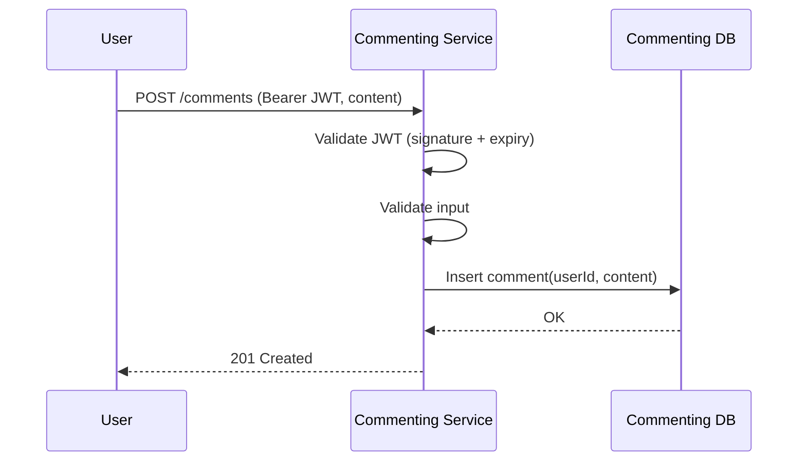
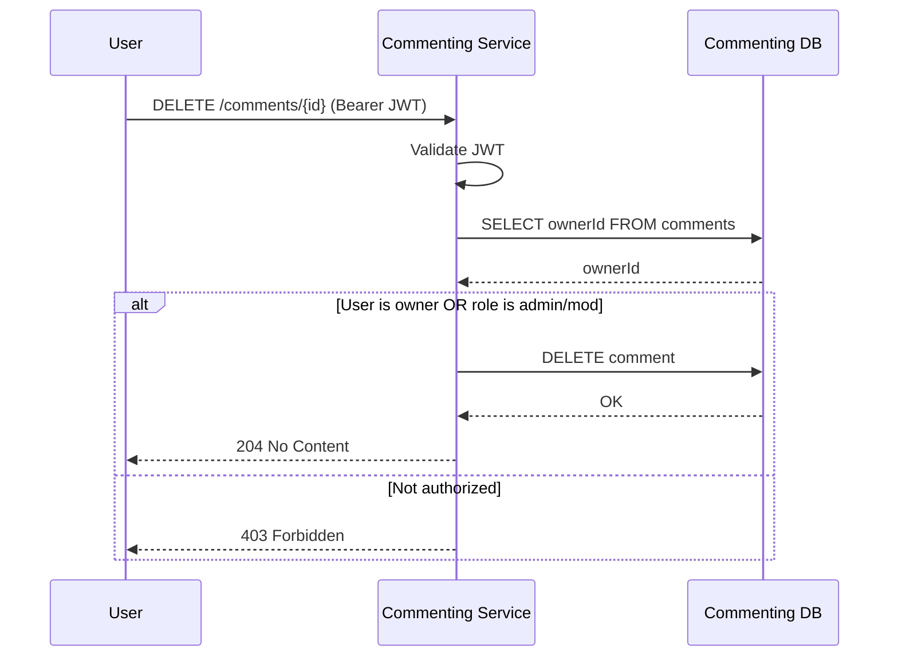
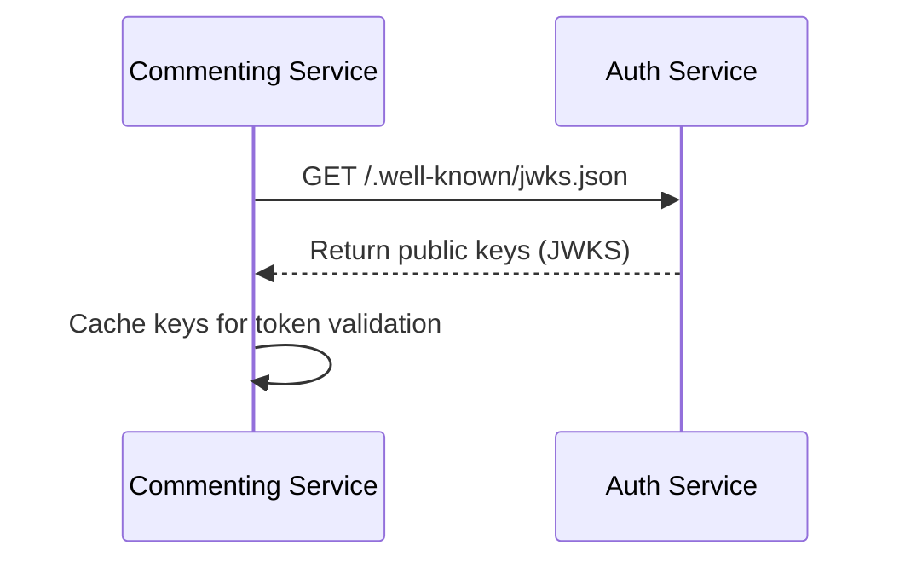

# System Diagrams

This document contains the main architecture and flow diagrams for the Commenting System.

---

## 1. High Level Architecture (Microservices)

---

## 2. Login Flow (Auth Service)

---

## 3. Create Comment Flow

---

## 4. Delete Comment Flow (Authorization Check)

---

## 5. Service-to-Service (JWT Public Key Fetch)

