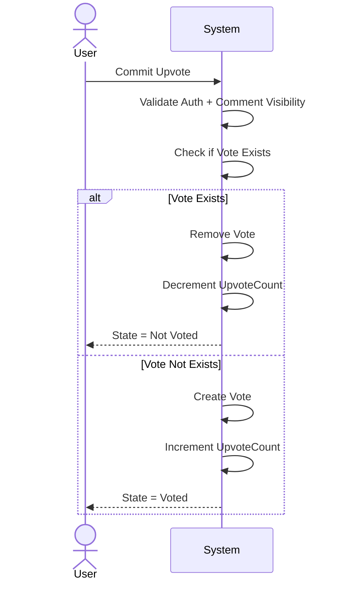

# System Diagrams

This document contains the main architecture and flow diagrams for the Commenting System.

---

## 1. High Level Architecture (Microservices)

---

## 2. Create Comment  (Comment Service)

---

## 3. Delete  Comment Flow

---

## 4. Edit Comment Flow 

---

## 5. Replay flow

## 6. Upvote Flow (Toggle Behavior)

